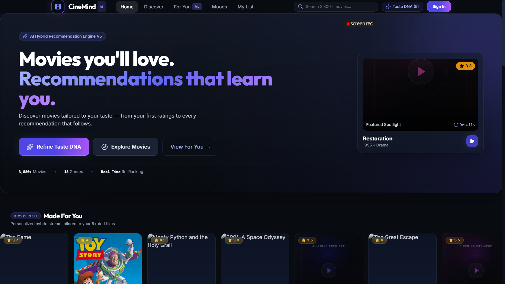
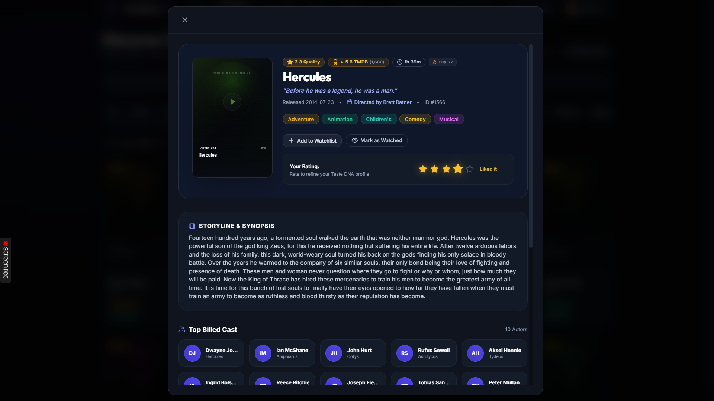
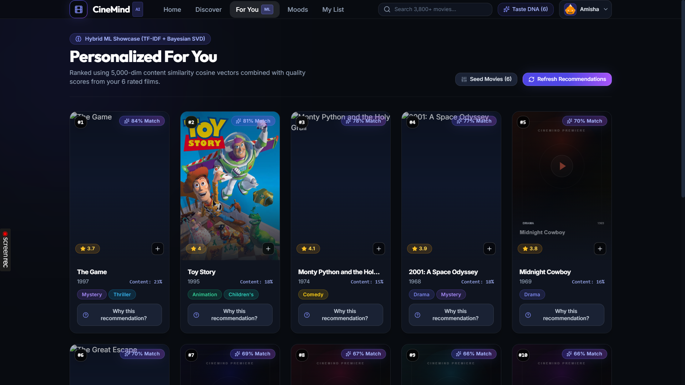
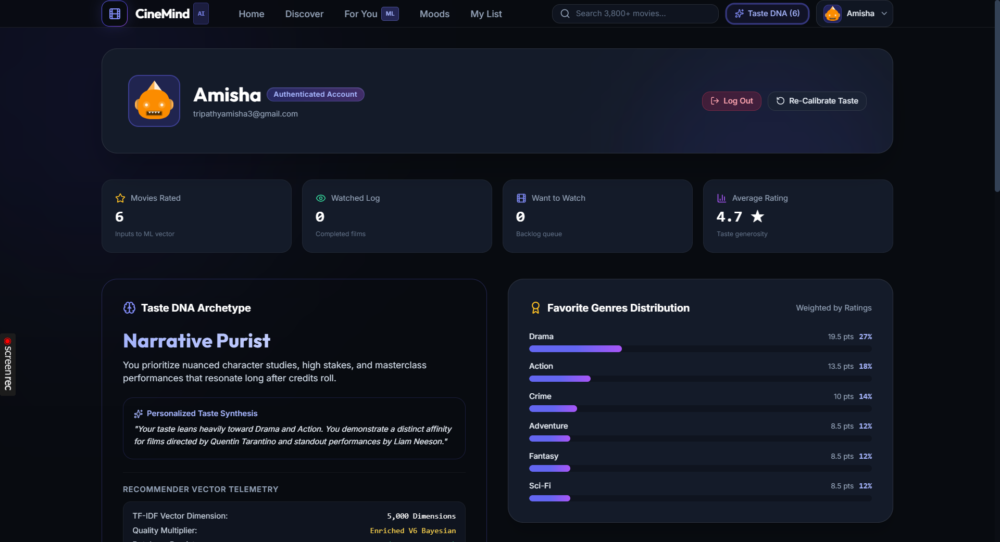
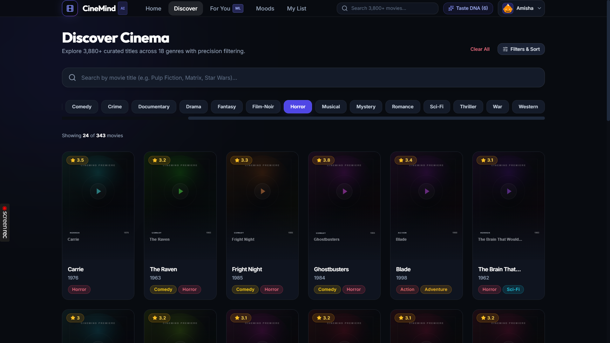
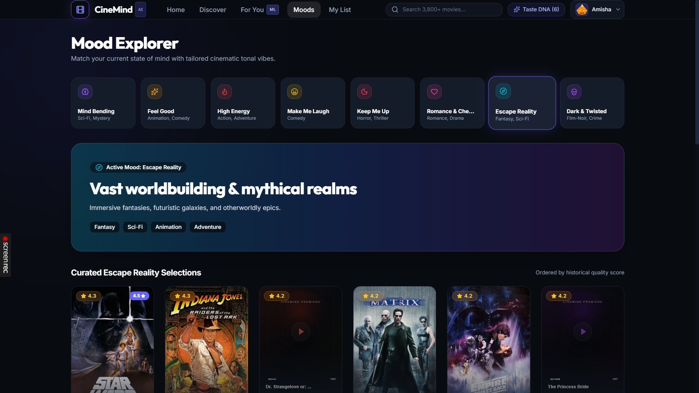
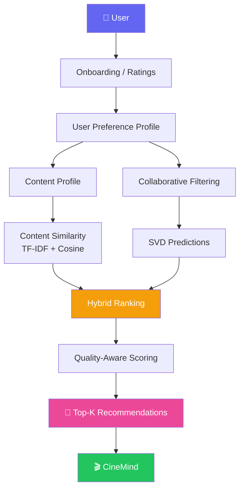
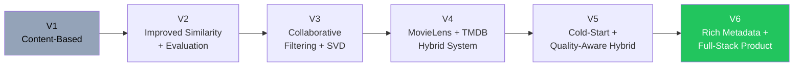

<div align="center">

# 🎬 CineMind
### Intelligent Movie Recommendation System

*A full-stack hybrid recommendation platform blending content-based filtering, collaborative filtering, and quality-aware ranking.*

[](https://www.python.org/)
[](https://fastapi.tiangolo.com/)
[](https://react.dev/)
[](https://www.typescriptlang.org/)
[](https://vitejs.dev/)
[](https://tailwindcss.com/)
[](https://scikit-learn.org/)
[](https://www.sqlite.org/)

[](LICENSE)
[](https://github.com/yourusername/cinemind/stargazers)
[](https://github.com/yourusername/cinemind/issues)
[](https://github.com/yourusername/cinemind/commits/main)

[Demo](#-demo) • [Features](#-features) • [Architecture](#-recommendation-pipeline) • [Getting Started](#-getting-started) • [Dataset](#-dataset) • [Roadmap](#-future-improvements)

</div>

---

## 📸 Demo

<div align="center">

| Home / Discovery | Movie Details | Recommendations |
|:---:|:---:|:---:|
|  |  |  |

| Onboarding | Watchlist | Explanation |
|:---:|:---:|:---:|
|  |  |  |


</div>

---

## 🧾 Overview

**CineMind** is an intelligent, full-stack movie recommendation platform that combines **content-based filtering**, **collaborative filtering**, **hybrid recommendation**, **user preference modeling**, and **movie metadata** to deliver personalized movie recommendations.

The project evolved through multiple iterations — from a basic TF-IDF content recommender into a production-style application featuring cold-start onboarding, rating-aware personalization, quality-aware ranking, authentication, movie discovery, watchlists, and explainable recommendations.

---

## ✨ Features

<table>
<tr>
<td width="50%" valign="top">

### 🎯 Personalized Recommendations
Recommendations dynamically adapt to each user's ratings and evolving preferences.

### 🧠 Hybrid Recommendation Engine
Combines content similarity, collaborative filtering, and movie quality into a single ranked score.

### 🆕 Cold-Start Onboarding
New users rate a handful of movies during onboarding to instantly unlock personalized recommendations.

### ⭐ Rating-Aware User Profiles
User ratings are used to construct rich, rating-weighted preference profiles.

### 🎭 Actor & Director Preferences
User taste is modeled across favorite genres, actors, and directors.

</td>
<td width="50%" valign="top">

### 🔎 Movie Discovery
Browse and explore the catalog filtered by genre.

### 🎬 Rich Movie Details
Overview, rating, runtime, tagline, cast, crew, and director information.

### 🔗 Similar Movies
Instantly find movies similar to any selected title.

### ❤️ Watchlist / My List
Save movies to revisit later.

### 🔐 Authentication
Secure registration, login, and JWT-based session handling.

### 💡 Explainable Recommendations
Understand *why* a movie was recommended, backed by 📊 Precision, Recall & NDCG evaluation.

</td>
</tr>
</table>

---

## 🧠 Recommendation System

CineMind uses a **multi-stage hybrid recommendation architecture**.

### Cold-Start Personalization
One of the major improvements over a basic recommender is how it handles new users. During onboarding, users select and rate movies they've already watched. These ratings are mapped to movie metadata to construct a **rating-weighted user preference vector** — enabling personalized recommendations even with little to no prior interaction history.

### Hybrid Ranking
Rather than relying on a single similarity metric, the final recommendation score blends multiple signals:

| Signal | Description |
|---|---|
| 🧩 **Content Similarity** | TF-IDF + cosine similarity across genres, cast, crew, and overview |
| 🤝 **Collaborative Filtering** | SVD-based predictions from the MovieLens ratings matrix |
| ⭐ **Movie Quality** | Aggregate rating signal to balance popularity vs. personalization |

**Current V5 Configuration:**

```yaml
content_weight: 0.5
quality_weight: 0.5
top_k: 10
```

---

## 🔄 Recommendation Pipeline



---

## 📊 Dataset

<table>
<tr>
<td width="50%" valign="top">

### MovieLens 1M
Used for collaborative filtering and user-rating interactions.

| Metric | Value |
|---|---|
| 👥 Users | 6,040 |
| 🎞️ Movies | 3,706 |
| ⭐ Ratings | 1,000,209 |
| 📉 Sparsity | ~95.53% |

</td>
<td width="50%" valign="top">

### TMDB Movie Dataset
Provides rich movie metadata and content information, including:

- Genres & overviews
- Cast & crew
- Runtime & tagline
- Director information

</td>
</tr>
</table>

---

## 🛠️ Tech Stack

<table>
<tr>
<td valign="top" width="25%">

**Frontend**
- React
- TypeScript
- Vite
- Tailwind CSS
- Node.js / npm

</td>
<td valign="top" width="25%">

**Backend**
- Python
- FastAPI
- Uvicorn
- PostgreSQL
- JWT Authentication

</td>
<td valign="top" width="25%">

**Machine Learning**
- Pandas / NumPy
- Scikit-learn
- Surprise (SVD)
- TF-IDF
- Cosine Similarity

</td>
<td valign="top" width="25%">

**Data & Metadata**
- MovieLens 1M
- TMDB metadata
- Genres, cast, crew
- Ratings & runtime

</td>
</tr>
</table>

The frontend delivers the interactive discovery, onboarding, recommendation, authentication, profile, movie details, and watchlist experience. FastAPI exposes REST endpoints consumed by the React frontend, and trained ML artifacts are serialized and loaded at inference time — so the deployed app serves recommendations without retraining.

---

## 🚀 Getting Started

### 1. Clone the repository

```bash
git clone <repository-url>
cd "Movie Recommendation System"
```

### 2. Create and activate a Python environment

```bash
python -m venv .venv
```

**Windows:**
```bash
.venv\Scripts\activate
```

**macOS / Linux:**
```bash
source .venv/bin/activate
```

### 3. Install backend dependencies

```bash
pip install -r requirements.txt
```

### 4. Start the backend

```bash
cd backend
uvicorn main:app --reload
```

The API will be available at:

```
http://127.0.0.1:8000
```

### 5. Start the frontend

Open another terminal:

```bash
cd frontend
npm install
npm run dev
```

The frontend will then be available through the Vite development server. 🎉

---

## 🔐 Environment Variables

Sensitive configuration should be stored in environment variables rather than committed to Git. Create a local `.env` file when required.

```env
DATABASE_URL=your-postgresql-connection-string
JWT_SECRET_KEY=your-secret-key
```

> `.env` files are intentionally excluded from version control.

---

## 🧪 Development & Evaluation

The project was developed incrementally, with the recommendation engine evolving through multiple versions:



This progression allowed the project to move from a basic ML prototype toward a production-oriented recommendation application, evaluated using **Precision**, **Recall**, and **NDCG**.

---

## 🎯 Project Goals

CineMind was designed to demonstrate practical understanding of:

- 🎬 Recommendation systems &nbsp;•&nbsp; 🧪 Machine learning pipelines &nbsp;•&nbsp; 🤝 Collaborative filtering
- 🧩 Content-based filtering &nbsp;•&nbsp; 🧠 Hybrid recommendation systems &nbsp;•&nbsp; 🆕 Cold-start problems
- 🛠️ Feature engineering &nbsp;•&nbsp; 📊 Model evaluation &nbsp;•&nbsp; 🌐 REST API development
- 🖥️ Full-stack application development &nbsp;•&nbsp; 🔐 Authentication &nbsp;•&nbsp; 🔗 Data integration
- 📦 ML model serialization and inference

---

## 🔮 Future Improvements

- [ ] Real-time learning from user interactions
- [ ] More advanced deep-learning recommendation models
- [ ] Transformer-based semantic embeddings
- [ ] Improved collaborative filtering
- [ ] A/B testing of ranking strategies
- [ ] Real-time recommendation feedback
- [ ] Better explainability using feature-level recommendation reasons

---

<div align="center">

### ⭐ If you find this project interesting, consider giving it a star!

Made with 🎬 + 🧠 by [Amisha](https://github.com/Amisha-55)

</div>
